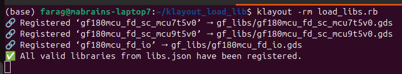
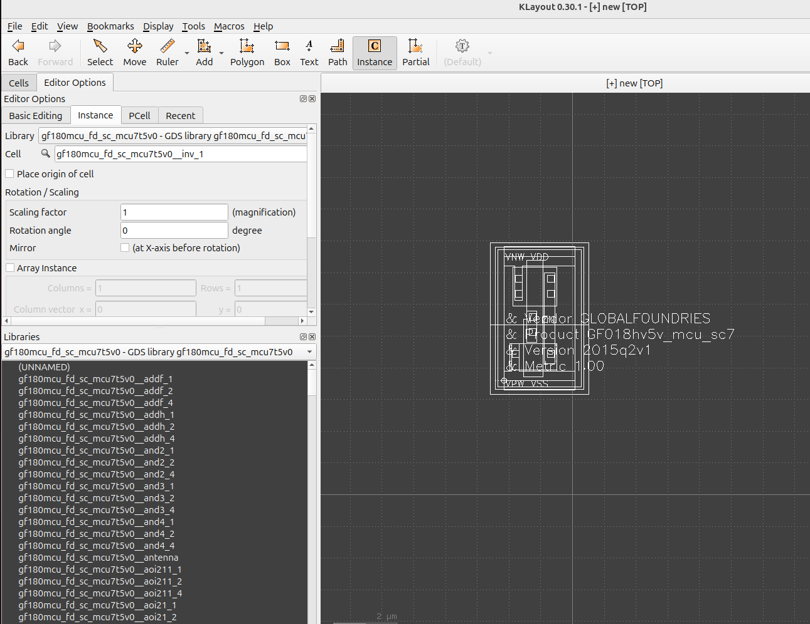

# KLayout Library Manager

[](/LICENSE)  

[<p align="center">](http://mabrains.com/)

## Introduction

This setup enables KLayout to register external GDS files as libraries, making them available for reference.

## Prerequisites

- klayout 0.29.11+

## 📁 Directory Structure

```
├── example_libs/                       # Folder containing examples for GDS libraries
├── libs.json                           # JSON mapping of library_name → GDS path
├── load_libs.rb                        # Ruby script to load and register the libraries
└── README.md                           # This documentation file
```

## 🚀 Usage

Launch KLayout in GUI mode by running the following script:

```bash
klayout -rm library_manager.rb
```

Example for json file:

```json
{
  "gf180mcu_fd_sc_mcu7t5v0": "example_libs/gf180mcu_fd_sc_mcu7t5v0.gds",
  "gf180mcu_fd_sc_mcu9t5v0": "example_libs/gf180mcu_fd_sc_mcu9t5v0.gds",
  "gf180mcu_fd_io": "example_libs/gf180mcu_fd_io.gds"
}
```

After running the script, you should see the following output in the terminal confirming successful registration of libraries from `libs.json`:

<p align="center">
  
</p>
<p align="center">
  Fig. 1. Command-line Output of Registered External GDS Libraries
</p>

After loading, the libraries will appear in the Library palette under the names defined in `libs.json`.

You can then create a new layout and instantiate cells from these libraries by dragging them from the palette.  
This allows reuse of added cells without embedding them into your GDS design.

<p align="center">
  
</p>
<p align="center">
  Fig. 2. Instantiating a Cell from a Loaded Library in KLayout
</p>

## About Mabrains

Mabrains was founded to achieve the main purpose to change the world of Chip Design using AI. Empowering the world with a new methodologies and techniques that would disrupt the status quo in the EDA industry.

We have contributed in developing many PDKs for Open Source Tools. For more information, please refer to [Mabrains-Github](https://github.com/mabrains).

## Contact-Us

Requests for more information about Generic PDK and other open source technologies can be [submitted via this web form](https://mabrains.com/#contactus).
