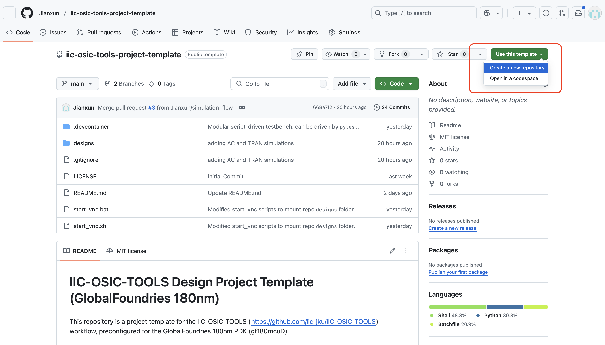

This repository is set up as a GitHub template. Using the template feature gives you a clean project without the template's commit history.

1. Visit the template repository: [https://github.com/Jianxun/iic-osic-tools-project-template/](https://github.com/Jianxun/iic-osic-tools-project-template/)
2. Click the green **"Use this template"** button
3. Select **"Create a new repository"**
4. Fill in your repository details:
   - Repository name (e.g., `my-analog-design-project`)
   - Description (optional)
   - Choose public or private
5. Click **"Create repository"**
6. Clone your new repository to your local machine



**Clone your new repository using GitHub Desktop:**
1. Open GitHub Desktop
2. Click "Clone a repository from the Internet"
3. Select your newly created repository
4. Choose your local directory and click "Clone"

![Screenshot placeholder: GitHub Desktop clone dialog]

**Clone your new repository using Git Command Line:**
```bash
git clone https://github.com/YOUR-USERNAME/YOUR-REPOSITORY-NAME.git
cd YOUR-REPOSITORY-NAME
```